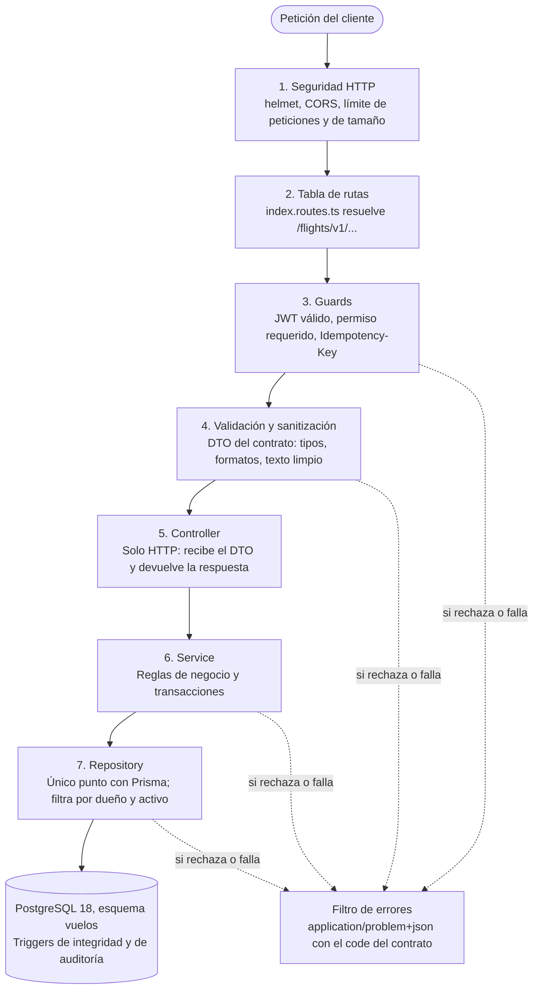

# Plan del backend — Quinde · API de Vuelos

Actualizado: 2026-10-05 (cierre de la fase 2) · Este archivo se actualiza al cerrar cada fase.

El backend se construye sobre la plantilla del equipo (NestJS 10 en TypeScript), con Prisma sobre la base PostgreSQL 18 que ya está cargada, en 12 fases que terminan con la API desplegada en Render para RDA1.

## Avance

| Fase | Estado | Verificado |
| --- | --- | --- |
| 0. Base del repo | Hecha (2026-10-05) | `npm ci`, `npm run lint`, `npm run format:check` y `npm run build` pasan en un clon limpio; el hook rechaza mensajes de commit inválidos; `db/reset.sh` carga esquema y semilla en PostgreSQL 18 |
| 1. Núcleo | Hecha en local (2026-10-05); falta el despliegue en Render | Cada commit pasa `npm ci`, `build`, `lint` y `format:check` por separado. Con el `.env` local: `GET /flights/v1/health` responde 200 y la base registra el `SELECT 1`; `/flights/v2/health` responde 404; `/api/docs` abre y `/api/docs-json` lista la ruta. Con la base caída, `/health` responde 503. La imagen de `docker build` arranca, responde lo mismo contra la base local y su HEALTHCHECK queda `healthy`. La extensión bloquea `delete` y `deleteMany` y la transacción auditada deja usuario e IP en `auditoria` (probado dentro de una transacción revertida) |
| 2. Transversales | Hecha (2026-10-05) | `lint`, `format:check`, `build` y `test:e2e` (137 pruebas contra la base real) pasan en cada commit. Con `curl` contra la API: ruta inexistente → 404 `application/problem+json`; `POST` sobre ruta existente que no lo admite → 405 con `Allow`; cuerpo inválido, campo no permitido, HTML en un texto y UUID mal formado → 400 `VALIDATION_FAILED` con `invalidParams`; errores de base provocados a propósito (unique, FK, `ON DELETE RESTRICT`) → 409/422 sin detalles internos, y la base queda igual (0 filas nuevas en `pais` y en `auditoria`); error no controlado → 500 sin detalle ni stack; 105 peticiones en un minuto → 429 con `Retry-After`; cuerpo de más de 100 kB → 413; cabeceras de helmet presentes; Swagger UI en `/api/docs` carga en un navegador headless sin errores de consola ni peticiones fallidas; `X-Request-Id` generado, respetado si es válido, reemplazado si no, y presente en los errores |
| 3 a 11 | Pendientes | |

## Decisiones

La plantilla manda en lenguaje y framework; lo único que se reemplaza es el ORM.

| Tema | Decisión | Por qué |
| --- | --- | --- |
| Lenguaje | TypeScript | La plantilla ya está en TypeScript. Nest usa decoradores y tipos para validar los DTO y generar Swagger; en JavaScript habría que reescribirla y agregar Babel. Esto cambia lo que habíamos dicho antes (JavaScript). |
| Framework | NestJS 10, el de la plantilla | Es Nest, no Next: Next.js es para frontend con React. Se queda en la versión 10 para no separarse de los otros equipos. |
| ORM | Prisma 7.10 (versión fija) en lugar de TypeORM | La plantilla trae TypeORM con `synchronize: true`, que crea y altera tablas a partir de las entidades. Nuestra base nace del SQL y tiene triggers y ENUM; Prisma solo la lee con `db pull`. Prisma 7 exige un adaptador: se usa `@prisma/adapter-pg`. |
| Cliente de Prisma | Generado en `src/generated`, fuera de git | Lo crea `prisma generate` en el `postinstall`; así no se versiona código generado ni se desfasa del `schema.prisma`. |
| Fuente de verdad de la base | Los archivos de `db/` | Un cambio se hace en el SQL y después se corre `prisma db pull`. No se usa `prisma migrate`. |
| Rutas | Una sola tabla en `src/routes/index.routes.ts` | Usa el `RouterModule` de Nest: cada módulo declara su ruta en un `*.routes.ts` y el índice las junta. Los controladores no llevan prefijos. |
| Versionado | En la URL: `/flights/v1/...` | Es la misma base que el `servers` del contrato. Prefijo global `flights` más versionado de Nest con versión 1 por defecto; una v2 se agrega por controlador con `@Version('2')`. |
| Capas de cada módulo | routes → controller → service → repository, más mapper y dto | Un módulo por entidad. El controller solo maneja HTTP, el service tiene las reglas, el repository es el único que usa Prisma y el mapper traduce la fila en español al JSON del contrato. |
| Idioma | Rutas y JSON en inglés; código, carpetas y base en español | El contrato fija el inglés hacia afuera. Un mapper por módulo traduce entre los dos. |
| Errores | Filtro global que responde `application/problem+json` | El contrato exige `ProblemDetails` con un `code` de lista cerrada. |
| Documentación viva | Swagger generado del código en `/api/docs` | Una prueba compara el OpenAPI generado con `contracts/vuelos-openapi.yaml`, para que no se separen. |
| Autenticación | Módulo `auth` propio que emite JWT | El contrato deja la identidad en otro servicio, pero en RDA1 la API tiene que funcionar sola. En RDA2 se cambia por el proveedor real. |
| Eliminación | Lógica: `activo = false` o cambio de estado | Ningún endpoint ejecuta un `DELETE` de SQL sobre datos de negocio. |
| CRUD de catálogo | Rutas `/flights/v1/admin/...`, fuera del contrato, con una clase base compartida | El contrato no tiene mantenimiento de aeropuertos, vuelos ni tarifas, y el curso pide CRUD. Las 10 entidades repiten listar, ver, crear, editar y dar de baja lógica. |
| Swagger | `/api/docs`, versión 1.5.0.0, esquema bearer, 7 etiquetas del contrato más las propias | Las etiquetas viven en `src/config/swagger.ts` (`ETIQUETAS`) para que cada controller use la misma. |
| Pagos y GDS | Simulados | El pago llega como `paymentReference` y se da por bueno; la emisión de boletos es local. |

El diseño de rutas está probado sobre la plantilla: `GET /flights/v1/bookings/{bookingId}/tickets` respondió 200 y `/flights/v2/...` respondió 404.

## Nombre y logo

El proyecto se llama **Quinde**: así se le dice al colibrí en Ecuador, la palabra viene del kichwa y el ave es rápida y precisa al volar.

| Dónde | Valor |
| --- | --- |
| Repositorio y `name` del `package.json` | `quinde-vuelos-api` |
| Título en Swagger | Quinde · API de Vuelos |
| Descripción en Swagger | Implementación del contrato GDS Flight Core API v1.5.0.0 para vuelos nacionales de Ecuador |
| Emisor de los JWT (`iss`) | `quinde-vuelos-api` |
| Logo | `docs/logo.svg`, usado en el README y como ícono de Swagger |

Una búsqueda rápida no mostró ninguna aerolínea ecuatoriana con ese nombre. No es una revisión de marcas registradas; para un proyecto de curso alcanza.

## Camino de una petición

Cada llamada baja por siete capas y solo la última usa Prisma; guards, validación, service y repository pueden cortar el camino, y el filtro de errores le da a todos los fallos la misma forma.



Por eso un controlador nunca abre la base ni arma un error a mano: recibe un DTO ya validado, llama al service y devuelve lo que este responde.

## Esqueleto

Todo lo de vuelos queda dentro de `src/modules/vuelos`, como pide la plantilla, con **un módulo por entidad**: `catalogo/` para el CRUD de administrador y `operaciones/` para los endpoints del contrato. Fuera de vuelos quedan `salud` y `auth`. Lo transversal va en `common`, `config`, `prisma` y `routes`. Lo marcado con ✓ ya existe al cerrar la fase 1.

```text
quinde-vuelos-api/
├── contracts/                    # contratos de la plantilla, no se tocan
├── db/                           # fuente de verdad de la base
│   ├── esquema_vuelos.sql
│   ├── esquema_seguridad.sql     # fase 3: usuarios, roles y tokens
│   ├── semilla_vuelos.sql
│   ├── semilla_seguridad.sql     # roles, permisos y usuario administrador
│   ├── prueba_esquema.sql
│   └── reset.sh
├── docs/                         # PLAN.md, logo.svg, logo-icono.svg (ícono de Swagger)
├── prisma/
│   └── schema.prisma             # ✓ lo escribe db pull, no se edita a mano
├── prisma.config.ts              # ✓ datasource del CLI (lee .env con dotenv)
├── src/
│   ├── main.ts                   # ✓ arranque: crea la app y llama a configurarApp
│   ├── configurar-app.ts         # ✓ prefijo flights, versión v1, middlewares, pipes, Swagger (lo usan main y los e2e)
│   ├── app.module.ts             # ✓
│   ├── config/
│   │   ├── entorno.ts            # ✓ variables validadas al arrancar (obligatorias y opcionales)
│   │   ├── seguridad.ts          # ✓ helmet, CORS y tope del cuerpo
│   │   ├── limite-peticiones.ts  # ✓ opciones de @nestjs/throttler
│   │   ├── origenes-cors.ts      # ✓ lectura y validación de CORS_ORIGINS
│   │   ├── proxy.ts              # ✓ lectura y validación de TRUST_PROXY
│   │   └── swagger.ts            # ✓ título, versión, bearer, ETIQUETAS, ícono
│   ├── routes/
│   │   └── index.routes.ts       # ✓ la única tabla de rutas de la API
│   ├── generated/prisma/         # ✓ cliente generado (fuera de git)
│   ├── prisma/
│   │   ├── prisma.module.ts      # ✓ global
│   │   ├── prisma.service.ts     # ✓ db (cliente extendido) y transaccionAuditada
│   │   ├── serializacion-bigint.ts  # ✓ BigInt → texto en JSON
│   │   └── extensiones/          # ✓ bloqueo de delete físico, actor de auditoría
│   ├── common/
│   │   ├── decorators/           # ✓ @Publico, @LimiteEstricto, @SinLimiteDePeticiones; luego @Scopes, @UsuarioActual
│   │   ├── dto/                  # de la plantilla: respuesta base y paginación
│   │   ├── guards/               # ✓ limite-peticiones (global) e idempotency-key (plantilla); jwt-auth y scopes en la fase 3
│   │   ├── contexto/             # ✓ request id, IP y usuario de la petición en curso (AsyncLocalStorage)
│   │   ├── errores/              # ✓ códigos del contrato, ErrorNegocio, traducción de errores de Prisma y de triggers
│   │   ├── filters/              # ✓ problem-details.filter.ts
│   │   ├── logger/               # ✓ logger de Nest con el request id en cada línea
│   │   ├── interceptors/         # idempotencia (fase 6)
│   │   ├── pipes/                # ✓ ValidationPipe global, uuid, fecha, código IATA
│   │   └── sanitizacion/         # ✓ @TextoLimpio y piezas sueltas (ver su README)
│   └── modules/
│       ├── salud/                # ✓ GET /health
│       ├── auth/                 # registro, login, refresh, logout, me
│       └── vuelos/
│           ├── vuelos.module.ts  # ✓ junta los submódulos (vacío por ahora)
│           ├── vuelos.routes.ts  # ✓ cuelga las rutas de catálogo y operaciones
│           ├── compartido/       # cálculo de precios, mapeo de enums español ↔ contrato
│           ├── catalogo/         # CRUD de administrador en /admin/...
│           │   ├── base/         # clase base compartida: repository, service y controller
│           │   ├── pais/
│           │   ├── ciudad/
│           │   ├── aeropuerto/
│           │   ├── aerolinea/
│           │   ├── modelo-aeronave/
│           │   ├── familia-tarifa/
│           │   ├── mapa-asientos/
│           │   ├── vuelo/
│           │   ├── vuelo-programado/
│           │   └── tarifa/
│           └── operaciones/      # endpoints del contrato
│               ├── busqueda/
│               ├── oferta/
│               ├── retencion/
│               ├── reserva/
│               ├── boleto/
│               ├── equipaje/
│               ├── cambio-fecha/
│               ├── cancelacion/
│               ├── checkin/
│               ├── pase-abordar/
│               ├── estado-vuelo/
│               └── webhook/
├── test/                         # ✓ pruebas e2e (Jest + supertest) contra la base real; utils/ con crearApp y fixtures
├── Dockerfile                    # ✓ multi-etapa para Render
├── docker-compose.yml            # ✓ PostgreSQL 18; puerto con DB_PORT
└── .env.example                  # ✓
```

Cada entidad repite la misma forma. Ejemplo con aeropuerto:

```text
catalogo/aeropuerto/
├── aeropuerto.module.ts
├── aeropuerto.routes.ts      # [{ path: 'airports', module: AeropuertoModule }]
├── aeropuerto.controller.ts  # @Controller() sin prefijo: solo HTTP
├── aeropuerto.service.ts     # reglas de negocio y transacciones
├── aeropuerto.repository.ts  # único archivo que usa Prisma
├── aeropuerto.mapper.ts      # fila en español → JSON del contrato en inglés
└── dto/                      # entrada y salida, con validación y Swagger
```

Las rutas se anidan con `RouterModule`: cada `*.routes.ts` exporta su arreglo, `vuelos.routes.ts` los cuelga (el catálogo bajo `admin`, las operaciones anidadas, por ejemplo `bookings/:bookingId/tickets` dentro de `bookings`) y el índice junta todo:

```ts
// src/routes/index.routes.ts
export const rutas: Routes = [
  ...saludRoutes, // health
  ...authRoutes, // auth (fase 3)
  ...vuelosRoutes, // admin/..., search, offers, bookings, flights, webhooks
];
```

El prefijo `flights` y la versión `1` no van en la tabla: los ponen `setGlobalPrefix` y `enableVersioning` en `main.ts`, así que toda ruta queda en `/flights/v1/<path>`.

## Mapa del contrato

Los 22 endpoints del contrato se reparten en 12 entidades de `operaciones/`. Todas las rutas cuelgan de `/flights/v1`.

| Endpoint | Entidad | Permiso | Idempotency-Key | Tablas principales |
| --- | --- | --- | --- | --- |
| `POST /search` | busqueda | Público, exige `X-Device-Fingerprint` | No | `vuelo_programado`, `inventario_cabina`, `tarifa_*`, `itinerario_*`, `oferta_*` |
| `GET /offers/{offerId}/seatmap` | oferta | Público | No | `mapa_asientos_*`, `asiento`, `reserva_detalle_asiento` |
| `POST /offers/hold` | retencion | `flights:hold` | Sí | `retencion_*`, `inventario_cabina` |
| `GET /offers/hold/{holdId}` | retencion | `flights:read` | No | `retencion_*` |
| `DELETE /offers/hold/{holdId}` | retencion | `flights:hold` | No | `retencion_cabecera` cambia de estado y devuelve el cupo |
| `GET /bookings` | reserva | `flights:read` | No | `reserva_cabecera` |
| `POST /bookings` | reserva | `flights:book` | Sí | `reserva_cabecera` y sus detalles, `boleto_*` |
| `GET /bookings/{bookingId}` | reserva | `flights:read` | No | `reserva_*` |
| `GET /bookings/{bookingId}/tickets` y `/tickets/{ticketId}` | boleto | `flights:read` | No | `boleto_cabecera`, `boleto_detalle` |
| `GET /bookings/{bookingId}/baggage-options` | equipaje | `flights:read` | No | `tarifa_*`, `familia_tarifa` |
| `POST /bookings/{bookingId}/baggage` | equipaje | `flights:book` | Sí | `reserva_detalle_equipaje`, `reserva_detalle_pago` |
| `POST /bookings/{bookingId}/date-change/search` | cambio-fecha | `flights:read` | No | `cambio_*` |
| `POST /bookings/{bookingId}/date-change` | cambio-fecha | `flights:book` | Sí | `cambio_*`, `reserva_detalle_itinerario` |
| `GET /bookings/{bookingId}/cancellation-quote` | cancelacion | `flights:read` | No | `cotizacion_cancelacion` |
| `POST /bookings/{bookingId}/cancel` | cancelacion | `flights:cancel` | Sí | `reserva_cabecera`, `boleto_*`, `inventario_cabina` |
| `POST /bookings/{bookingId}/check-in` | checkin | `flights:book` | No | `checkin`, `pase_abordar` |
| `GET /bookings/{bookingId}/boarding-passes` | pase-abordar | `flights:read` | No | `pase_abordar` |
| `GET /flights/{flightNumber}/status` | estado-vuelo | Público | No | `vuelo`, `vuelo_programado` |
| `GET /webhooks`, `POST /webhooks`, `DELETE /webhooks/{id}` | webhook | `flights:webhooks` | No | `webhook_*`, `evento`, `evento_entrega` |

Fuera del contrato se agregan tres grupos de rutas:

| Rutas | Módulo | Permiso | Para qué |
| --- | --- | --- | --- |
| `GET /health` | salud | Público | Chequeo de vida para Render; consulta la base. Hecho en la fase 1 |
| `POST /auth/register`, `/auth/login`, `/auth/refresh`, `/auth/logout`, `GET /auth/me` | auth | Público, salvo `logout` y `me` | Emitir los JWT mientras no exista el proveedor de identidad |
| `/admin/countries`, `/admin/cities`, `/admin/airports`, `/admin/airlines`, `/admin/aircraft-models`, `/admin/fare-families`, `/admin/seat-maps`, `/admin/flights`, `/admin/departures`, `/admin/fares` | catalogo (pais, ciudad, aeropuerto, aerolinea, modelo-aeronave, familia-tarifa, mapa-asientos, vuelo, vuelo-programado, tarifa) | `flights:admin` | CRUD con eliminación lógica |

## Seguridad

La API niega por defecto: toda ruta exige un JWT válido salvo las que se marcan con `@Publico()`.

### Autenticación

- El módulo `auth` hace de proveedor de identidad mientras no exista el real.
- Contraseñas con argon2id; nunca se guardan ni se registran en texto plano.
- Token de acceso JWT de 15 minutos con `sub`, `scope`, `iss`, `aud` y `jti`. El `sub` es el `id_propietario` de retenciones, reservas y webhooks.
- Token de refresco opaco de 7 días, guardado como hash, con rotación: cada uso lo reemplaza y reusar uno viejo cierra la sesión.
- Login limitado a 5 intentos por minuto por IP y con el mismo mensaje de error para usuario inexistente y contraseña mala.
- Las tablas `usuario`, `rol`, `alcance`, `rol_alcance`, `usuario_rol` y `token_refresco` van en `db/esquema_seguridad.sql`, dentro del esquema `vuelos`. Ninguna tabla de vuelos apunta a ellas, así que en RDA2 se quitan sin tocar el resto.

### Autorización

Dos controles, en este orden: el permiso del token y la propiedad del recurso.

| Rol | Permisos (`scope`) | Cómo se obtiene |
| --- | --- | --- |
| cliente | `flights:read`, `flights:hold`, `flights:book`, `flights:cancel` | Registro público |
| integrador | Los de cliente más `flights:webhooks` | Lo asigna un administrador |
| administrador | Todos más `flights:admin` | Semilla de seguridad |

- `@Scopes('flights:book')` en cada ruta; si el token no lo trae, responde 403.
- Toda consulta de retenciones, reservas y webhooks filtra por `id_propietario = sub`. Un recurso ajeno responde 404, para no revelar que existe.
- `flights:admin` es un permiso propio; no está en el contrato.

### Validación y sanitización

- `ValidationPipe` global con `whitelist`, `forbidNonWhitelisted` y `transform`: un campo que no está en el DTO rechaza la petición.
- Los DTO copian las reglas del contrato: tipos, enums, longitudes, formatos de fecha, UUID y códigos IATA.
- Texto libre (nombres, documentos, URL de webhook): se recorta, se normaliza a NFC y se rechaza si trae caracteres de control o etiquetas HTML.
- Prisma parametriza todas las consultas. `$queryRaw` solo con plantillas etiquetadas, nunca concatenando texto.
- Cabeceras de seguridad con helmet, CORS con lista de orígenes permitidos, cuerpo máximo de 100 kB y límite de peticiones con respuesta 429 y `Retry-After`.
- Los secretos viven en variables de entorno validadas al arrancar; si falta una, la API no levanta.
- La URL de un webhook debe ser `https` y no puede apuntar a direcciones internas.

### Eliminación lógica

- Catálogos y suscripciones tienen columna `activo`: el `DELETE` de la API hace `UPDATE ... SET activo = false` y las lecturas filtran `activo = true`.
- Lo transaccional no se da de baja, cambia de estado: una retención se libera y una reserva se cancela.
- El cliente de Prisma lleva una extensión que lanza error si alguien llama `delete` o `deleteMany` sobre una tabla de negocio.
- Solo se borran físicamente datos temporales vencidos: ofertas, itinerarios y claves de idempotencia.

### Auditoría

Cada escritura corre dentro de una transacción que primero fija `app.id_usuario` y `app.direccion_ip`. Con eso los triggers de la base llenan la tabla `auditoria` sin código extra en los servicios. La vía es `PrismaService.transaccionAuditada(actor, tx => ...)`, que usa `set_config(..., true)` para que el valor muera con la transacción y no pase a otra petición que reciba la misma conexión del pool.

## Fases

Las fases 0 a 3 son la base, la 4 fija el patrón de módulo y las 5 a 7 son el flujo de compra. La API se despliega desde la fase 1, no al final, para que los problemas de nube aparezcan temprano.

| Fase | Rama | Entrega | Hecha cuando |
| --- | --- | --- | --- |
| 0. Base del repo | `chore/f0-base` | Repo propio, lint, formato, reglas de commit, `db/` versionado, compose con PostgreSQL 18 | Un clon limpio levanta la base con `./db/reset.sh` y `npm run lint` pasa |
| 1. Núcleo | `feat/f1-nucleo` | Sin TypeORM, Prisma conectado, tabla de rutas, `/health`, Swagger, primer despliegue | `/flights/v1/health` responde 200 en Render y `/api/docs` abre |
| 2. Transversales | `feat/f2-transversales` | Errores `ProblemDetails`, validación, sanitización, helmet, CORS, límite de peticiones | Cualquier error, incluido un 404 de ruta, sale como `application/problem+json` |
| 3. Auth | `feat/f3-auth` | Registro, login, refresh, logout, guards de JWT y de permisos | Una ruta protegida responde 401 sin token y 403 sin el permiso |
| 4. Catálogo | `feat/f4-catalogo` | Clase base y CRUD de las 10 entidades de catálogo | Un `DELETE` deja la fila con `activo = false` y una fila en `auditoria` con el `sub` del administrador |
| 5. Búsqueda | `feat/f5-busqueda` | `POST /search` y mapa de asientos | UIO→GYE devuelve ofertas directas y UIO→GPS ofertas con escala, con precios iguales a los de la base |
| 6. Retenciones | `feat/f6-retenciones` | Hold con idempotencia y vencimiento | Dos peticiones simultáneas por el último cupo: una gana y la otra recibe 409 |
| 7. Reservas y boletos | `feat/f7-reservas` | `POST /bookings`, consultas, emisión de boletos | El flujo búsqueda → hold → reserva → boleto pasa de punta a punta en una prueba e2e |
| 8. Postventa | `feat/f8-postventa` | Equipaje, cambio de fecha, cancelación | Una oferta de cambio vencida responde 410 y una tarifa no cambiable responde 409 |
| 9. Check-in y estado | `feat/f9-checkin-estado` | Check-in, pases de abordar, estado de vuelo | El check-in fuera de ventana se rechaza y el pase sale con su código de barras |
| 10. Webhooks | `feat/f10-webhooks` | Suscripciones, eventos y entrega con reintentos | Una reserva confirmada llega firmada a una URL de prueba |
| 11. Entrega | `chore/f11-entrega` | Prueba de contrato, CI, guía de despliegue, versión 1.0.0 | El OpenAPI generado coincide con el contrato y la URL de Render pasa el flujo completo |

Si el tiempo aprieta antes de RDA1, lo primero que se recorta es la fase 10: se dejan alta, listado y baja de suscripciones y se pospone la entrega de eventos.

## Commits y reglas de Git

Cada fase es una rama, cada rama termina en un pull request a `main` y cada commit deja el proyecto compilando.

### Reglas

- Repositorio propio creado desde la plantilla, con la plantilla como remoto `upstream` para traer cambios del contrato.
- `main` protegida y siempre desplegable; Render despliega desde ahí.
- Mensajes en formato Conventional Commits y en español: `tipo(ámbito): verbo en infinitivo y qué cambia`. Tipos: `feat`, `fix`, `refactor`, `test`, `docs`, `chore`, `ci`, `style`, `perf`, `build`, `revert`. Un hook de husky con commitlint rechaza los que no cumplen.
- El pull request se une con merge commit, no con squash, para que el historial de commits quede visible.
- Una etiqueta por fase: `v0.1.0` al cerrar la fase 1 hasta `v1.0.0` en la entrega.
- `.env` nunca se sube. Una variable nueva entra a `.env.example` en el mismo commit que la usa.
- Un cambio de base va completo en un commit: el SQL de `db/`, el `schema.prisma` regenerado y el código que lo usa.

### Fase 0 · Base del repo

1. `chore: renombrar el proyecto a quinde-vuelos-api`
2. `chore: agregar eslint, prettier y editorconfig`
3. `style: aplicar prettier y quitar imports sin usar`
4. `fix(build): activar el módulo de vuelos y compilar solo ese dominio`
5. `chore: validar mensajes de commit con husky y commitlint`
6. `chore(db): versionar esquema, semilla y reset.sh`
7. `fix(docker): usar postgres 18 y montar el volumen en /var/lib/postgresql`
8. `docs: agregar README, logo y plan del backend`

Dos commits no estaban en el plan original. La plantilla no compila tal como viene (el módulo de atracciones tiene errores de TypeScript), así que el commit 4 activa solo `VuelosModule` y deja los módulos de los otros equipos fuera de la compilación. El commit 3 separa el cambio de formato del cambio de configuración.

### Fase 1 · Núcleo

1. `fix(docker): hacer configurable el puerto de la base y de la API`
2. `refactor: quitar TypeORM y el controlador de ejemplo de vuelos`
3. `feat(config): validar las variables de entorno al arrancar`
4. `feat(prisma): introspeccionar el esquema vuelos y agregar PrismaService`
5. `feat(prisma): bloquear el delete físico y agregar la transacción auditada`
6. `feat(rutas): agregar la tabla de rutas con prefijo flights y versión v1`
7. `feat(salud): agregar GET /health con chequeo de la base`
8. `docs(swagger): configurar título, versión del contrato, esquema bearer e ícono`
9. `ci: agregar Dockerfile multi-etapa para Render`
10. `docs: cerrar la fase 1 en el plan y el README`

El despliegue en Render con Neon queda fuera de esta rama: necesita credenciales y se hace a mano desde el panel. El commit 1 no estaba en el plan; el 2 también borra los DTO de ejemplo de la plantilla, que solo usaba el controlador mock (siguen en el historial y en `upstream`).

### Fase 2 · Transversales

1. `docs: agregar CLAUDE.md con las reglas del proyecto`
2. `test(infra): agregar Jest y supertest con un primer e2e de /flights/v1/health`
3. `feat(errores): agregar filtro global ProblemDetails y ErrorNegocio`
4. `feat(errores): traducir errores de Prisma y de triggers a códigos del contrato`
5. `feat(validacion): agregar ValidationPipe global y pipes de uuid, fecha e IATA`
6. `feat(sanitizacion): agregar decoradores de limpieza de texto para los DTO`
7. `feat(seguridad): agregar helmet, CORS por lista de orígenes y tope de 100 kB`
8. `feat(seguridad): agregar límite de peticiones global con Retry-After`
9. `feat(contexto): agregar X-Request-Id y contexto por petición con AsyncLocalStorage`
10. `docs: cerrar la fase 2 en el plan y los README`

Los commits 1 y 2 (CLAUDE.md y Jest) no estaban en el plan original. El e2e del commit 2 obligó a sacar la configuración de la app de `main.ts` a `configurar-app.ts`, para que las pruebas levanten la misma API que se despliega.

Variables de entorno nuevas, todas opcionales y en `.env.example`: `CORS_ORIGINS`, `RATE_LIMIT_MAX`, `RATE_LIMIT_WINDOW_SECONDS` y `TRUST_PROXY`.

### Fase 3 · Auth

1. `feat(db): tablas de seguridad y semilla de roles`
2. `feat(auth): registro e inicio de sesión con argon2 y JWT`
3. `feat(auth): refresh con rotación y cierre de sesión`
4. `feat(auth): guard JWT global y decorador Publico`
5. `feat(auth): guard de permisos y decorador Scopes`
6. `feat(auth): decorador UsuarioActual y endpoint me`
7. `test(auth): e2e de login, token vencido y permiso faltante`

### Fase 4 · Catálogo

1. `feat(catalogo): clase base de CRUD con eliminación lógica`
2. `feat(catalogo): CRUD de países y ciudades`
3. `feat(catalogo): CRUD de aeropuertos`
4. `feat(catalogo): CRUD de aerolíneas y modelos de aeronave`
5. `feat(catalogo): CRUD de familias tarifarias y mapas de asientos`
6. `feat(catalogo): CRUD de vuelos y vuelos programados`
7. `feat(catalogo): CRUD de tarifas`
8. `test(catalogo): e2e de alta, edición, baja lógica y auditoría`

### Fase 5 · Búsqueda

1. `feat(busqueda): DTO de búsqueda según el contrato`
2. `feat(busqueda): armar itinerarios directos y con escala`
3. `feat(busqueda): calcular precios por tipo de pasajero y crear ofertas`
4. `feat(busqueda): mapa de asientos por segmento`
5. `test(busqueda): e2e de ruta directa, con escala y sin vuelos`

### Fase 6 · Retenciones

1. `feat(idempotencia): interceptor sobre clave_idempotencia`
2. `feat(retenciones): crear hold descontando cupo en una transacción`
3. `feat(retenciones): consultar y liberar hold`
4. `feat(retenciones): vencer holds y devolver cupos`
5. `test(retenciones): e2e de concurrencia sobre el último cupo`

### Fase 7 · Reservas y boletos

1. `feat(reservas): crear reserva desde un hold con pasajeros y pago simulado`
2. `feat(reservas): asignar asientos y aplicar reglas de infantes`
3. `feat(reservas): listado paginado y detalle del dueño`
4. `feat(boletos): emitir y consultar boletos`
5. `test(reservas): e2e de búsqueda a boleto`

### Fase 8 · Postventa

1. `feat(postventa): opciones y compra de equipaje`
2. `feat(postventa): buscar y confirmar cambio de fecha`
3. `feat(postventa): cotizar y cancelar la reserva`
4. `test(postventa): e2e de oferta vencida y tarifa no cambiable`

### Fase 9 · Check-in y estado

1. `feat(checkin): check-in con ventana de tiempo`
2. `feat(checkin): pases de abordar`
3. `feat(estado): estado de vuelo por número y fecha`
4. `test(checkin): e2e de check-in y pase de abordar`

### Fase 10 · Webhooks

1. `feat(webhooks): alta, listado y baja lógica de suscripciones`
2. `feat(eventos): registrar eventos de negocio`
3. `feat(eventos): entrega firmada con reintentos`
4. `test(webhooks): e2e de suscripción y entrega`

### Fase 11 · Entrega

1. `test(contrato): comparar el OpenAPI generado con el contrato`
2. `ci: lint, build y pruebas en GitHub Actions`
3. `docs: guía de despliegue y colección de peticiones`
4. `chore(release): versión 1.0.0 para RDA1`

## Hallazgos

### Fase 1

Lo que hace Prisma 7 con nuestra base, verificado con `prisma db pull` contra PostgreSQL 18:

| Tema | Qué pasó | Qué implica |
| --- | --- | --- |
| Introspección | 42 modelos y 16 enums desde `?schema=vuelos`, sin `@@schema` porque hay un solo esquema | Los modelos se llaman como las tablas (`vuelo_programado`, `reserva_cabecera`) |
| ENUM | Cada `CREATE TYPE ... AS ENUM` pasa a un `enum` de Prisma con los mismos valores en español (`PROGRAMADO`, `RETENIDA`...); en la consulta llegan como texto | La traducción al inglés del contrato va en los mappers (`compartido/`) |
| `COMMENT ON` | No se copia el texto. Prisma deja solo un aviso genérico (`/// This model or at least one of its fields has comments in the database...`) en el modelo o enum, y nada en los campos comentados | La documentación de columnas y la equivalencia de enums con el contrato siguen viviendo solo en `db/esquema_vuelos.sql` |
| `CHECK` | No se representan; solo un aviso por modelo | Las reglas las sigue haciendo cumplir la base; los DTO repiten las que el cliente debe conocer y el filtro de la fase 2 traduce la violación (23514) |
| Vistas | Las 3 vistas de la sección 16 no se introspeccionan (haría falta `previewFeatures = ["views"]`) | Se decide en la fase 5 o 7: activar `views` o leerlas con `$queryRaw` |
| Triggers y funciones | No aparecen en el esquema de Prisma | Siguen actuando igual; por eso la auditoría y la integridad no dependen del código |
| Índices parciales | `db pull` agregó `previewFeatures = ["partialIndexes"]` por sí solo | Ninguna acción |
| Comentarios en `schema.prisma` | `db pull` reescribe el archivo y borra cualquier comentario, incluso dentro del `generator` | Las explicaciones van en `prisma.config.ts`, no en el esquema |
| `bigint` | Llega como `BigInt` y `JSON.stringify` lanza `TypeError` | `BigInt.prototype.toJSON` lo serializa como texto (`habilitarBigIntEnJson` en `main.ts`). Las PK bigint son internas; el contrato expone los uuid |
| `numeric` | Llega como `Prisma.Decimal`, que en JSON sale como texto (`"100"`) | Los mappers lo convierten a número o a texto con dos decimales, según el contrato |
| `date` | Llega como `Date` a medianoche UTC (`fecha_salida`) | Al formatear, no aplicar zona horaria o se corre un día hacia atrás en Ecuador |
| `GENERATED ALWAYS AS IDENTITY` | Sale como `@default(autoincrement())` | Nunca enviar `id` al crear; la base lo rechaza |
| `?schema=vuelos` | El adaptador de `pg` no lo lee de la URL | `PrismaService` lo extrae de la URL y lo pasa en `{ schema }` |
| Conexión | Con el adaptador, `$connect()` no abre conexión; sin tope, `pg` espera indefinidamente a una base caída | Al arrancar se prueba con `SELECT 1`, y el pool corta a los 5 s |
| `prisma.config.ts` | Prisma 7 ya no lee `.env` por su cuenta | Se carga con `import 'dotenv/config'` |
| Extensión de imports | El generador deduce si poner `.ts` en los imports según encuentre un `tsconfig`; en `docker build` generaba `./internal/class.ts` y Node no arrancaba | `importFileExtension = ""` fijo en el `generator` |
| Peers opcionales | `@prisma/client` declara `prisma` y `typescript` como peers opcionales; npm los instala con `--omit=dev` | La imagen usa también `--omit=optional` (de 846 MB a 524 MB) |
| Transacciones anidadas | En Prisma 7, `$transaction` ya no está prohibido dentro de una transacción interactiva | `TransaccionVuelos` lo permite; no se usa por ahora |
| Bloqueo de delete | La extensión cubre `delete` y `deleteMany`, pero no los borrados anidados dentro de un `update` ni `$executeRaw` | Esos casos quedan para revisión de código; los `ON DELETE RESTRICT` del esquema siguen de respaldo |

### Fase 2

Lo que se vio al probar Prisma 7 (adaptador de `pg`) contra PostgreSQL 18.6, con transacciones que siempre se revierten:

| Tema | Qué pasó | Qué implica |
| --- | --- | --- |
| Dónde está el error de la base | El dato útil está en `error.meta.driverAdapterError.cause`: `originalCode` (SQLSTATE), `kind` y a veces `constraint.index`. El `code` de Prisma cambia según cómo se consulte: el mismo SQLSTATE sale como P2003 con un modelo y como P2010 con `$queryRaw` | `traducir-error-bd.ts` decide por SQLSTATE, no por el `code` de Prisma |
| `ON DELETE RESTRICT` (pendiente de la fase 1) | PostgreSQL 18.6 responde SQLSTATE **23001** (`restrict_violation`), no 23503 (no se probó con otra versión). Prisma lo reconoce: `kind: RestrictViolation` y `constraint.index` con el nombre de la FK. Con un modelo (delete anidado en un `update`) llega como **P2003**; con SQL crudo como **P2010** (`Code: 23001`). Un `INSERT` con padre inexistente sí es 23503 | Se traduce a 409 en los dos caminos. Un `INSERT`/`UPDATE` con padre inexistente (23503) es 422 |
| Triggers de la sección 15 | `RAISE EXCEPTION ... USING ERRCODE = 'check_violation', CONSTRAINT = ...` llega como SQLSTATE 23514 con solo el mensaje: el nombre de la restricción **no** viaja (el adaptador copia `code`, `severity`, `message` y `detail`) | Los 4 triggers se reconocen por el texto de su mensaje en español. Si se cambia ese texto en el SQL, hay que cambiarlo en `POR_MENSAJE_TRIGGER`; `test/errores-bd.e2e-spec.ts` dispara los 4 contra la base y falla si se desfasan |
| CHECK sin trigger | El nombre sí viaja, dentro del mensaje (`violates check constraint "ck_..."`) | Se extrae con una expresión regular y se busca en `POR_RESTRICCION` |
| `auditoria` inmutable | `UPDATE`/`DELETE` sobre `auditoria` lanza SQLSTATE 42501 | No se traduce: es un error de programación, responde 500 y queda en el log |
| SQL crudo y el esquema | El adaptador solo aplica `{ schema }` a las consultas con modelo; `$queryRaw`/`$executeRaw` fallan con `relation "pais" does not exist` si la tabla no se califica | En SQL crudo, siempre `vuelos.<tabla>` |
| Base caída | Con un modelo: `PrismaClientKnownRequestError` P1001 (`kind: DatabaseNotReachable`); con `$queryRaw`: P2010 con el mismo `kind` | 503 con `Retry-After: 5`, sin host ni puerto en la respuesta |
| Choque concurrente | SQLSTATE 40001 llega como P2010 (raw) o P2034 (modelo), `kind: TransactionWriteConflict` | 409 con `Retry-After: 1` |
| Errores del parser de Express | El cuerpo de más de 100 kB o el JSON roto llegan como `http-errors` (`status`, `expose`, `type`), no como `HttpException`; sin tratarlos salían como 500 | `errorDelParser` los pasa a 413/400/415 |
| `ProblemDetails` y `code` | El esquema exige `code` y su lista no trae códigos para 401, 403, 404, 405, 413, 415 ni 5xx; no admite campos extra | Esos casos usan `VALIDATION_FAILED` y el `status` dice qué pasó (ver `CODIGO_SIN_EQUIVALENTE` en `codigo-error.ts`, un solo lugar para cambiarlo). El `type` es `about:blank` salvo cuando hay código específico |
| `invalidParams` | El esquema sí lo admite | La validación llena `detail` (`campo: razón; ...`) e `invalidParams` (lista estructurada, rutas como `pasajeros[0].edad`) |
| 405 | Nest responde 404 a un método no admitido | El filtro revisa las rutas registradas de Express (`app._router.stack`) y devuelve 405 con `Allow` |
| Límite de peticiones | `@nestjs/throttler` cuenta por ruta e IP por defecto; los guards no corren en rutas que no existen, así que un 404 no cuenta; `/health` se excluyó a propósito | El contador `default` se configuró por IP para toda la API; `estricto` (por ruta) solo corre con `@LimiteEstricto`. Los 404 siguen sin límite. El almacén es memoria de un proceso: con más de una instancia de la API cada una cuenta aparte |
| Parser y contexto asíncrono | Los eventos de la petición que escucha body-parser se emiten fuera del `AsyncLocalStorage`; si el contexto se abre antes, el parser lo pierde | El request id se asigna en el primer middleware (guardado también en `req`) y el contexto asíncrono se abre después del parser |
| `X-Request-Id` inválido | No se rechaza la petición: se reemplaza por un UUID generado | La respuesta siempre trae un id válido. No va en el cuerpo del error (el esquema no admite campos extra) |
| `trust proxy` | Sin configurarlo, detrás de Render todas las peticiones tienen la IP del proxy: el límite por IP se aplicaría a todos juntos y la auditoría guardaría la IP del proxy | `TRUST_PROXY=1` en Render. Por defecto `false`: así no se puede falsear la IP con `X-Forwarded-For`. `true` se rechaza |
| Windows y `\uXXXX` | Al escribir archivos con una herramienta, las secuencias `‮` se convirtieron en el carácter real y rompieron una expresión regular | Los invisibles se arman con `String.fromCodePoint` |

## Pendientes

Tres cosas las decides tú o el equipo; el resto se verifica en la fase que corresponde.

- [ ] Confirmar con el equipo o el docente que el módulo de vuelos puede usar Prisma en lugar del TypeORM de la plantilla.
- [ ] Definir dónde vive el código: repo propio o una rama `vuelos` dentro de la plantilla. El plan sirve para los dos casos.
- [ ] Fecha de entrega de RDA1, para repartir las fases en semanas.
- [x] Fase 1: probar `prisma db pull` contra `?schema=vuelos`. Funciona con `prisma@7.10.0` fijo (ver Hallazgos).
- [ ] Fase 1: desplegar en Render con Neon (crear el servicio desde el `Dockerfile`, cargar `DATABASE_URL`, `NODE_ENV=production`, health check en `/flights/v1/health`) y cargar `db/esquema_vuelos.sql` y la semilla en Neon. Después, etiqueta `v0.1.0`.
- [x] Fase 2: el filtro de errores traduce `BorradoFisicoProhibidoError` (500, queda en el log) y la base caída (503).
- [ ] Fase 3: el guard global de JWT debe respetar `@Publico()`, que ya marca `/health`, y registrar el `sub` con `fijarUsuario()` (`common/contexto`) para que la auditoría lo lleve. Debe ir después de `GuardLimitePeticiones` en los providers de `CommonModule`; el login lleva `@LimiteEstricto(5, 60)`.
- [x] Fase 2: revisar cómo reporta Prisma el `ON DELETE RESTRICT`: SQLSTATE 23001, P2003 con un modelo y P2010 con SQL crudo (ver Hallazgos de la fase 2).
- [ ] Equipo: el contrato obliga a un `code` de lista cerrada pero no trae uno para 401, 403, 404, 405, 413, 415 ni 5xx. Hoy se usa `VALIDATION_FAILED` en esos casos; si el equipo acuerda códigos propios, se cambia en `codigo-error.ts`.
- [ ] Fase 1/2: en Render poner `TRUST_PROXY=1` y `CORS_ORIGINS` con el origen del frontend.
- [ ] Fase 2: las rutas que no existen (404) no cuentan en el límite de peticiones porque no pasan por ningún guard; si hace falta limitarlas, hay que pasar a un middleware.
- [ ] Fase 1: el servicio gratuito de Render se duerme tras 15 minutos sin uso; la primera petición después tarda.
- [ ] Fase 7: la tabla `pais` solo tiene Ecuador, así que un pasajero con otra nacionalidad se rechaza hasta agregar su país.
- [ ] Fase 11: la semilla cubre 90 días desde el día en que se carga; hay que volver a sembrar antes de la entrega.
